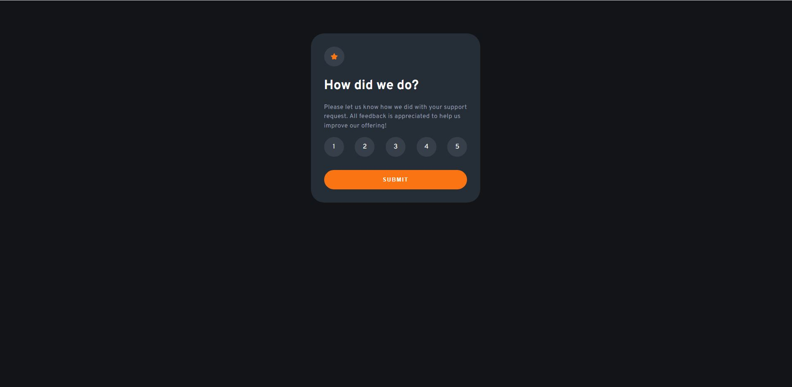
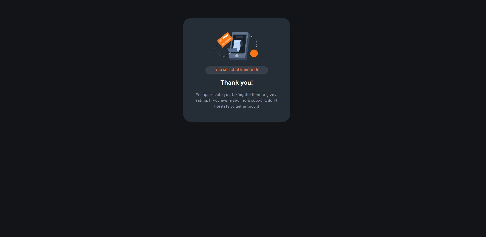

# Frontend Mentor - Interactive rating component solution

This is a solution to the [Interactive rating component challenge on Frontend Mentor](https://www.frontendmentor.io/challenges/interactive-rating-component-koxpeBUmI). Frontend Mentor challenges help you improve your coding skills by building realistic projects. 

## Table of contents

- [Overview](#overview)
  - [The challenge](#the-challenge)
  - [Screenshot](#screenshot)
  - [Links](#links)
- [My process](#my-process)
  - [Built with](#built-with)
  - [What I learned](#what-i-learned)
  - [Continued development](#continued-development)
  - [Useful resources](#useful-resources)
- [Author](#author)

## Overview

### The challenge

Users should be able to:

- View the optimal layout for the app depending on their device's screen size
- See hover states for all interactive elements on the page
- Select and submit a number rating
- See the "Thank you" card state after submitting a rating

### Screenshot

### Links

- Solution URL: [GitHub](https://github.com/gmathankumar/Interactive-rating-component)
- Live Site URL: [Demo](https://gmathankumar.github.io/Interactive-rating-component)

## My process

### Built with

- Semantic HTML5 markup
- CSS custom properties
- Flexbox
- CSS Grid
- JS

### What I learned

I have realised that I need to brush up my JS skill along with HTML and CSS to shine.

### Continued development

Aiming to concentrate further on strenghtning my JS skills.

### Useful resources
I restructured all of my code based on the following this [CodePen](https://codepen.io/TingHueiChen/pen/eYVWEay)

## Author

- SWebsite - [SENA Natural Products](https://senanaturalproducts.in/)
- Frontend Mentor - [@gmathankumar](https://www.frontendmentor.io/profile/gmathankumar)
